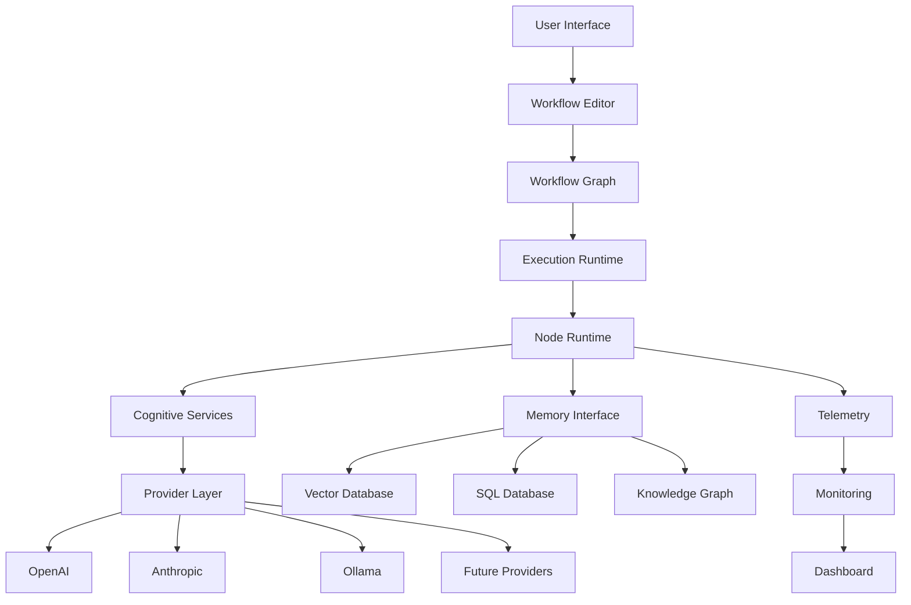

# MindMesh Architecture

Version: 1.0

---

# Overview

MindMesh is designed as a modular visual cognition platform.

Rather than implementing a fixed workflow editor, the architecture provides a reusable execution environment capable of orchestrating heterogeneous cognitive pipelines composed of independent processing nodes.

Every subsystem has a single responsibility and communicates through explicit interfaces.

The architecture prioritizes:

- Modularity
- Extensibility
- Runtime flexibility
- Provider independence
- Observable execution
- Secure data flow

---

# High-Level Architecture

```text
                 User
                   │
                   ▼
        Visual Workflow Editor
                   │
                   ▼
        Workflow Execution Layer
                   │
     ┌─────────────┼──────────────┐
     ▼             ▼              ▼
Node Runtime   State Engine   Event Bus
     │             │              │
     └─────────────┼──────────────┘
                   ▼
         Cognitive Services
                   │
    ┌──────────────┼────────────────┐
    ▼              ▼                ▼
LLM Providers   Tools API     Memory Layer
                   │
                   ▼
              External Systems
```

---

# System Layers

MindMesh is divided into independent architectural layers.

```
Presentation Layer
↓

Workflow Layer

↓

Execution Layer

↓

Service Layer

↓

Infrastructure Layer
```

Each layer communicates only with adjacent layers.

---

# Layer Responsibilities

## Presentation Layer

Responsible for user interaction.

Components:

- Workflow Canvas
- Node Library
- Inspector Panel
- Property Editors
- Monitoring Dashboard
- Execution Controls

Technologies

- React
- XYFlow
- TypeScript

Responsibilities

- Render workflows
- Manage interactions
- Display runtime state
- Visual debugging

---

## Workflow Layer

Represents workflows independently from execution.

Components

- Graph Builder
- Node Registry
- Edge Registry
- Validation Engine
- Serialization

Responsibilities

- Build graphs
- Validate connections
- Export workflows
- Import workflows

No execution occurs here.

---

## Execution Layer

Transforms workflow graphs into executable pipelines.

Components

- Runtime Scheduler
- Execution Queue
- Dependency Resolver
- Context Manager
- Result Collector

Responsibilities

- Execute nodes
- Resolve dependencies
- Manage execution order
- Propagate outputs

---

## Service Layer

Provides reusable services shared by nodes.

Examples

- Prompt Refinement
- Image Generation
- Web Scraping
- Reddit
- Telegram
- Cost Tracking
- Telemetry
- Authentication
- Memory API

Services are provider-independent.

---

## Infrastructure Layer

Lowest level.

Responsible for:

- APIs
- Storage
- Logging
- Security
- Configuration
- Monitoring

Nothing above directly accesses infrastructure.

---

# Runtime Architecture

Execution follows a directed graph.

```text
Workflow

↓

Validation

↓

Execution Plan

↓

Dependency Resolution

↓

Node Execution

↓

Output Propagation

↓

Workflow Complete
```

Nodes execute only after receiving all required inputs.

---

# Node Execution Model

Each node implements a common interface.

```python
class Node:

    id

    inputs

    outputs

    execute(context)

    validate()

    metadata
```

Every custom node follows this contract.

---

# Data Flow

Information moves through immutable messages.

```text
Node A

↓

Output Object

↓

Connection

↓

Input Port

↓

Node B
```

Nodes never mutate upstream data.

This guarantees deterministic execution.

---

# Execution Context

Every workflow owns an isolated context.

Contains:

- variables
- execution state
- provider settings
- runtime metadata
- cache
- temporary outputs

Contexts never leak between workflows.

---

# Provider Architecture

MindMesh is designed around a provider-independent architecture.

Providers are treated as interchangeable execution backends rather than core application logic.

```text
                Provider Interface
                       │
      ┌────────────────┼────────────────┐
      ▼                ▼                ▼
   OpenAI         Anthropic         Ollama
      ▼                ▼                ▼
      └────────────────┼────────────────┘
                       ▼
                Unified Response
```

Every provider implements the same internal contract.

```python
Provider

initialize()

generate()

stream()

embed()

health_check()
```

This abstraction allows providers to be replaced without modifying workflow logic.

---

# Cognitive Services

Cognitive services are reusable capabilities available to any workflow.

Unlike workflow nodes, services are stateless and can be invoked from multiple execution contexts simultaneously.

Examples include:

- Prompt refinement
- Image generation
- Text generation
- Web scraping
- Content extraction
- Translation
- Summarization
- Embedding generation
- Cost estimation
- Token accounting

Services expose standardized APIs regardless of the underlying provider.

---

# Memory Integration

MindMesh is prepared for persistent memory integration.

Although workflows remain stateless by default, future versions may attach external memory providers.

```text
Workflow

↓

Memory Interface

↓

Semantic Search

↓

Retrieved Context

↓

Node Execution
```

Memory implementations may include:

- Vector databases
- SQL databases
- Local storage
- Knowledge graphs
- Document repositories

The execution engine never depends on a specific storage technology.

---

# Event Bus

The Event Bus coordinates communication between runtime components.

```text
Node Started

↓

Execution Event

↓

Subscribers

↓

Logging
Monitoring
Metrics
UI Updates
```

Benefits:

- Loose coupling
- Real-time monitoring
- Easier debugging
- Plugin extensibility
- Distributed execution readiness

---

# Plugin Architecture

MindMesh is designed to support third-party extensions.

Plugins may contribute:

- New node types
- Service providers
- UI components
- Workflow validators
- Export formats
- Integrations

```text
Plugin

↓

Registration

↓

Node Registry

↓

Available in Canvas
```

Plugins are isolated from the core runtime.

---

# Security Architecture

Security is enforced through multiple independent layers.

```text
User

↓

Authentication

↓

Authorization

↓

Workflow Validation

↓

Execution Sandbox

↓

External Services
```

Key principles include:

- Principle of least privilege
- Provider isolation
- Secret management
- Input validation
- Secure defaults
- Immutable execution logs

Sensitive credentials are never stored inside workflow definitions.

---

# Observability

MindMesh provides visibility into every workflow execution.

Metrics include:

- Node execution time
- Provider latency
- Token consumption
- Estimated cost
- Error rates
- Queue length
- Memory usage
- CPU utilization

Future versions may integrate with:

- Prometheus
- Grafana
- OpenTelemetry

---

# Performance Strategy

The execution engine is optimized around asynchronous processing.

Key techniques include:

- Async I/O
- Incremental rendering
- Lazy loading
- Provider caching
- Parallel node execution
- Execution batching

Independent branches of the workflow graph may execute concurrently whenever dependencies allow.

---

# Repository Structure

```text
mindmesh/

├── frontend/
│   ├── components/
│   ├── canvas/
│   ├── inspector/
│   ├── hooks/
│   ├── providers/
│   ├── state/
│   └── utils/
│
├── backend/
│   ├── api/
│   ├── runtime/
│   ├── workflow/
│   ├── providers/
│   ├── services/
│   ├── memory/
│   ├── telemetry/
│   ├── security/
│   └── storage/
│
├── docs/
│
├── examples/
│
├── plugins/
│
├── tests/
│
└── README.md
```

The repository organization mirrors the logical architecture, ensuring that documentation, implementation, and future extensions remain aligned.

---

# Future Architecture

The current implementation targets a single-machine execution model.

Future versions may introduce:

- Distributed execution
- Remote execution workers
- Multi-user collaboration
- Persistent workflow server
- Cloud synchronization
- Shared knowledge spaces
- Live collaborative editing
- Workflow versioning
- Remote plugin registry
- Execution clusters

These capabilities can be added without changing the core architectural principles.

---

# Architectural Principles

Every architectural decision follows the same philosophy.

- Visual first.
- Provider independent.
- Modular by default.
- Observable at runtime.
- Secure by design.
- Extensible without modifying the core.
- Workflow definitions remain portable.
- Execution remains deterministic whenever possible.

The architecture is intentionally designed to evolve from a personal workflow tool into a reusable cognitive workflow platform capable of supporting research, engineering, content creation, automation, and future AI-native applications.

---

# Architecture Summary



---

**End of Document**
