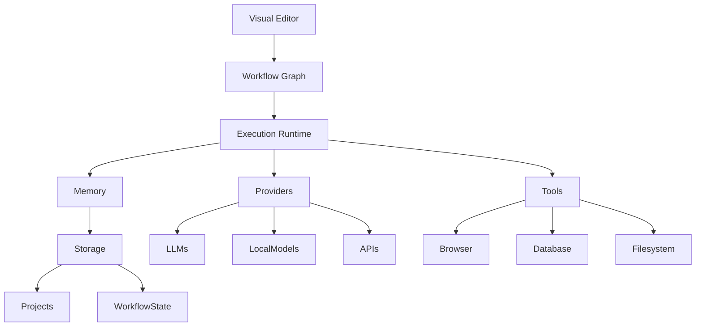

# MindMesh

## Visual Development Environment for AI-Native Systems

> Design, orchestrate and evolve intelligent workflows through a visual programming environment built for modern AI applications.

---

## Overview

MindMesh is an open-source visual development platform for designing, executing and managing AI-native workflows.

Instead of writing orchestration logic manually, developers construct systems through interconnected visual components representing reasoning, memory, decision-making, external tools and execution pipelines.

MindMesh combines the flexibility of node-based programming with a modular execution engine, enabling complex AI systems to be designed, understood and evolved visually.

The project is designed to remain model-independent and can integrate with cloud models, local inference servers or future AI providers without changing workflow architecture.

---

## Vision

Software engineering evolved from writing machine code to using integrated development environments.

Artificial intelligence requires the same evolution.

MindMesh aims to become a visual IDE where developers design intelligent systems instead of manually connecting prompts, APIs and scripts.

The long-term objective is to provide a platform capable of building workflows for:

- Autonomous AI agents
- Research assistants
- Engineering systems
- Business automation
- Robotics
- Knowledge management
- Decision support systems
- Future AI-native applications

MindMesh focuses on architecture rather than providers.

Models change.

Workflows remain.

---

## Design Philosophy

MindMesh follows five architectural principles.

### Visual First

Complex AI systems should be understandable through architecture rather than source code alone.

Every workflow should communicate its behavior visually.

---

### Model Independence

No workflow depends on a specific AI provider.

Execution nodes communicate through abstract capabilities instead of vendor-specific APIs.

Replacing a model should never require rebuilding the workflow.

---

### Modular Composition

Every capability exists as an independent node.

Small reusable components are preferable to monolithic pipelines.

Reusable workflows become organizational assets.

---

### Human-Centered Automation

Automation should remain observable.

Humans can inspect, validate, interrupt and modify execution at any point.

The platform enhances human decision-making rather than replacing it.

---

### Extensible Architecture

The platform is designed around extension points.

Developers can create:

- Custom nodes
- Custom execution engines
- External integrations
- Domain-specific toolkits
- Community extensions

without modifying the platform core.

---

# Why MindMesh

Traditional automation platforms focus on connecting services.

Traditional prompt tools focus on interacting with language models.

MindMesh focuses on building intelligent systems.

It provides an architectural layer where reasoning, memory, decision-making, execution and human validation coexist inside a unified visual environment.

---

## Core Concepts

MindMesh is composed of five fundamental layers.

```text
Visual Interface

↓

Workflow Graph

↓

Execution Runtime

↓

External Providers

↓

Persistent State
```

Each layer is independent.

This separation allows workflows to evolve without affecting the underlying infrastructure.

---

## High-Level Architecture



---

# Platform Architecture

```text
                        MindMesh

┌────────────────────────────────────────────────────────────┐
│                     User Interface                         │
│                                                            │
│ Visual Graph • Inspector • HUD • Timeline • Debugger       │
└──────────────────────────┬─────────────────────────────────┘
                           │
                           ▼
┌────────────────────────────────────────────────────────────┐
│                    Workflow Layer                          │
│                                                            │
│ Nodes • Connections • Variables • Events                  │
└──────────────────────────┬─────────────────────────────────┘
                           │
                           ▼
┌────────────────────────────────────────────────────────────┐
│                    Execution Runtime                       │
│                                                            │
│ Scheduler • Context • State • Events • Queue              │
└──────────────────────────┬─────────────────────────────────┘
                           │
          ┌────────────────┼─────────────────┐
          ▼                ▼                 ▼

 Memory Engine      AI Providers      Tool Runtime

          ▼                ▼                 ▼

 Persistent DB      OpenAI/Ollama      APIs

                    Anthropic          Browser

                    Groq               Files

                    Local Models       Databases
```

---

# Core Platform Components

| Component | Responsibility |
|------------|----------------|
| Visual Editor | Workflow construction environment |
| Workflow Graph | Directed execution graph |
| Runtime Engine | Executes workflows |
| Node System | Modular functional components |
| Context Manager | Shares execution state |
| Variable System | Global and local variables |
| Tool Runtime | External integrations |
| Provider Layer | AI model abstraction |
| Memory Layer | Workflow persistence |
| Event Bus | Communication between nodes |
| Extension SDK | Third-party node development |

---

# Workflow Lifecycle

Every workflow follows the same execution model.

```text
Create Workflow

↓

Connect Nodes

↓

Configure Parameters

↓

Validate Graph

↓

Execute Runtime

↓

Observe Execution

↓

Store Results

↓

Reuse Workflow
```

---

# Node Categories

MindMesh organizes nodes into reusable functional categories rather than provider-specific implementations.

| Category | Examples |
|----------|----------|
| Input | User Input, File, API, Database |
| Processing | Transform, Parse, Filter |
| Reasoning | LLM, Multi-Agent, Evaluator |
| Decision | Condition, Switch, Validator |
| Memory | Session Memory, Vector Store |
| Human | Approval, Review |
| Tools | Browser, Python, Shell |
| Output | Report, Notification, Export |
| System | Variables, Timers, Events |

This abstraction allows workflows to remain independent from implementation details.

---

# Current Features

The current implementation already includes the foundations of the platform.

### Visual Workflow Editor

- Interactive node graph
- Drag-and-drop composition
- Persistent layouts
- Unlimited undo/redo
- Minimap
- Context menus
- Node inspector
- Dynamic node creation

### Runtime Features

- Real-time execution state
- Hardware telemetry
- Cost estimation
- Multi-provider integration
- Secure workflow export
- Visual debugging support

### Extensibility

- Runtime node factory
- Custom node definitions
- Modular backend services
- Provider abstraction layer
- Expandable architecture
---

# Execution Runtime

The Runtime Engine is responsible for transforming a visual workflow into an executable system.

Rather than simply traversing connected nodes, the runtime manages execution state, event propagation, shared context, scheduling and provider communication.

Its responsibilities include:

- Workflow validation
- Dependency resolution
- Event propagation
- Execution scheduling
- Context management
- Variable injection
- Error handling
- Runtime monitoring

Future versions will introduce asynchronous execution, distributed workers and parallel graph evaluation.

---

# Provider Abstraction Layer

MindMesh is designed to remain independent from any single AI provider.

Every reasoning node communicates with an abstract provider interface instead of vendor-specific SDKs.

Current and planned providers include:

| Provider | Status |
|-----------|--------|
| OpenAI | Supported |
| Anthropic | Supported |
| Ollama | Supported |
| Groq | Supported |
| LiteLLM | Supported |
| Local Models | Planned |
| Custom Providers | Planned |

Because workflows target capabilities rather than providers, changing models does not require rebuilding the workflow.

---

# Workflow Runtime

Every workflow executes inside an isolated runtime session.

Each execution maintains:

- Execution context
- Shared variables
- Node state
- Event history
- Runtime metrics
- Execution logs

This design enables deterministic execution and future replay capabilities.

---

# Extension SDK

MindMesh is designed as an extensible platform.

Developers will be able to build their own ecosystem through the SDK.

Extension points include:

- Custom Nodes
- Node Libraries
- AI Providers
- Tool Connectors
- Workflow Templates
- Inspector Panels
- Execution Hooks
- Validation Rules

The objective is to allow organizations to adapt MindMesh without modifying its internal architecture.

---

# Repository Structure

```
MindMesh/

├── frontend/
│
│   ├── components/
│   ├── nodes/
│   ├── inspector/
│   ├── panels/
│   ├── runtime/
│   ├── hooks/
│   ├── contexts/
│   ├── services/
│   ├── layouts/
│   └── assets/
│
├── backend/
│
│   ├── providers/
│   ├── runtime/
│   ├── workflow/
│   ├── telemetry/
│   ├── execution/
│   ├── memory/
│   ├── api/
│   └── services/
│
├── docs/
│
│   ├── CORE_CONCEPTS.md
│   ├── NODE_SYSTEM.md
│   ├── EXECUTION_ENGINE.md
│   ├── WORKFLOW_RUNTIME.md
│   ├── MEMORY.md
│   ├── SDK.md
│   ├── EXTENSIONS.md
│   └── UI_SYSTEM.md
│
├── examples/
│
├── extensions/
│
├── tests/
│
├── README.md
├── ARCHITECTURE.md
├── ROADMAP.md
├── CONTRIBUTING.md
├── SECURITY.md
└── CHANGELOG.md
```

---

# Example Workflow

```text
User Input

↓

Research Node

↓

LLM Analysis

↓

Decision Node

↓

Human Approval

↓

Memory Update

↓

Notification

↓

Export
```

The same execution model can support:

- Research assistants
- Business workflows
- Autonomous agents
- Engineering pipelines
- Content generation
- Data processing
- Internal automation

---

# Current Development Status

MindMesh is under active development.

The current implementation already provides:

- Interactive visual workflow editor
- Runtime node management
- Dynamic node creation
- Hardware telemetry
- AI provider integration
- Secure blueprint export
- Visual execution environment
- Cost monitoring
- Persistent workspace layouts

Upcoming milestones focus on execution orchestration, workflow runtime maturity and platform extensibility.

---

# Roadmap

Short-term priorities include:

- Workflow execution engine
- Global variable system
- Runtime debugger
- Node versioning
- Project management
- Execution history
- Performance profiling

Medium-term objectives include:

- Plugin SDK
- Marketplace
- Collaborative editing
- Multi-user workspaces
- Distributed execution
- Cloud synchronization

Long-term vision:

MindMesh evolves into a complete development environment for AI-native systems.

---

# Relationship with Sentience Core

MindMesh is designed to integrate naturally with Sentience Core.

```text
                 Sentience Ecosystem

          ┌────────────────────────────┐
          │       Sentience Core       │
          │ Cognitive Infrastructure   │
          └──────────────┬─────────────┘
                         │
                         ▼
          ┌────────────────────────────┐
          │         MindMesh           │
          │  Visual Development IDE    │
          └──────────────┬─────────────┘
                         │
        Design • Execute • Observe • Improve
                         │
                         ▼
               AI-native Applications
```

Sentience Core provides cognition.

MindMesh provides visual orchestration.

Applications consume both.

---

# Installation

## Frontend

```bash
cd frontend

npm install

npm run dev
```

## Backend

```bash
cd backend

pip install -r requirements.txt

uvicorn main:app --reload
```

---

# Philosophy

MindMesh is not intended to replace software development.

Its purpose is to make intelligent systems easier to design, understand and evolve.

Architecture should remain readable.

Execution should remain observable.

Automation should remain controllable.

---

# Contributing

MindMesh welcomes contributions focused on:

- Runtime improvements
- Node development
- Provider integrations
- Workflow optimization
- Documentation
- Testing
- Platform architecture

Please read `CONTRIBUTING.md` before submitting changes.

---

# License

MIT License.

---

# Author

**Sergio Andrés Serrano Monsalve**

AI Systems • Cognitive Architectures • Python Engineering

GitHub:https://github.com/Sergioh-alt

---

> **MindMesh**
>
> *Building the visual development environment for AI-native systems.*
