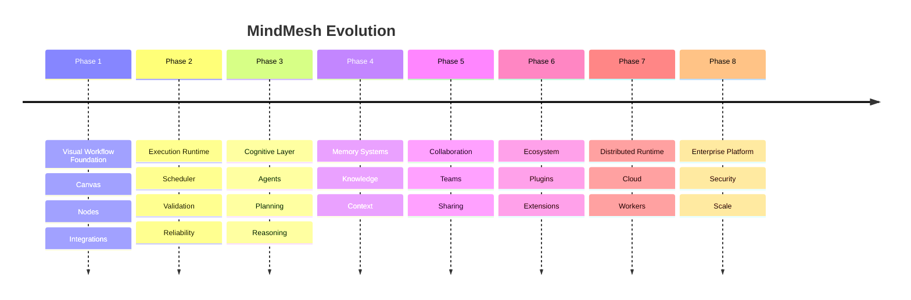

# MindMesh Roadmap

Version: 1.0

---

# Vision

MindMesh aims to become a modular cognitive workflow platform where humans can visually design, execute, monitor, and improve complex information-processing systems.

The long-term objective is to provide an infrastructure layer for AI-powered workflows across multiple domains:

- Research
- Engineering
- Content creation
- Automation
- Business operations
- Data analysis
- Knowledge management

MindMesh is not designed as a single-purpose AI application.

It is designed as a flexible execution environment where intelligence, tools, and workflows can be composed visually.

---

# Development Philosophy

MindMesh development follows several principles:

- Build a strong open-source foundation.
- Keep architecture modular and extensible.
- Prioritize developer experience.
- Maintain provider independence.
- Convert experimental features into reliable infrastructure.
- Design for future collaboration and distributed execution.

---

# Current Status

## Phase 1 — Foundation Platform

Status: Completed

The initial version establishes the core visual workflow environment.

Implemented capabilities:

- Interactive node-based canvas
- Graph editing
- Node creation system
- Workflow persistence
- Visual execution concepts
- Frontend/backend communication
- Runtime services
- External integrations

Current project state:

```
Visual Workflow Editor

+

Backend Execution Services

+

Extensible Node System
```

---

# Phase 2 — Runtime Stabilization

Status: In Progress

Objective:

Transform the current prototype execution model into a reliable workflow engine.

Goals:

## Execution Engine

Implement:

- Formal execution lifecycle
- Workflow validation
- Dependency resolution
- Execution queue
- Error recovery
- Execution history

Target architecture:

```
Workflow Definition

↓

Validation

↓

Execution Plan

↓

Runtime Scheduler

↓

Node Execution

↓

Results
```

---

## Node System Improvements

Goals:

- Standard node interface
- Node versioning
- Better input/output contracts
- Runtime validation
- Custom node SDK

Example:

```python
Node(
    name="ResearchAgent",
    inputs=["query"],
    outputs=["report"],
    execute()
)
```

---

# Phase 3 — Cognitive Workflow Layer

Status: Planned

Objective:

Move from automation workflows into AI-native cognitive workflows.

Capabilities:

## Intelligent Planning

Allow workflows to:

- Analyze objectives
- Generate execution plans
- Select appropriate tools
- Adapt execution paths

---

## Agent Integration

Introduce specialized AI agents:

Examples:

- Research Agent
- Analyst Agent
- Writer Agent
- Reviewer Agent
- Data Agent
- Engineering Agent

Architecture:

```
Goal

↓

Planner Agent

↓

Agent Network

↓

Tool Execution

↓

Result Evaluation
```

---

# Phase 4 — Memory and Knowledge Systems

Status: Planned

Objective:

Allow workflows to maintain persistent knowledge.

Features:

- Semantic memory
- Document ingestion
- Knowledge retrieval
- Experience storage
- Context management

Architecture:

```
Information

↓

Memory Layer

↓

Knowledge Retrieval

↓

Workflow Context

↓

Decision
```

---

# Phase 5 — Collaboration Platform

Status: Future

Objective:

Transform MindMesh from a personal tool into a collaborative platform.

Features:

- Multi-user workspaces
- Real-time collaboration
- Permission management
- Workflow sharing
- Team libraries
- Version control

---

# Phase 6 — Plugin Ecosystem

Status: Future

Objective:

Allow developers to extend MindMesh.

Capabilities:

- Custom nodes
- External integrations
- Community plugins
- Marketplace
- Provider extensions

Architecture:

```
Developer

↓

Plugin SDK

↓

Node Registry

↓

MindMesh Runtime
```

---

# Phase 7 — Distributed Execution

Status: Long-Term

Objective:

Enable large-scale workflow execution.

Future capabilities:

- Remote workers
- Cloud execution
- Distributed queues
- GPU workers
- Large workflow orchestration

Architecture:

```
MindMesh Controller

↓

Execution Scheduler

↓

Worker Nodes

↓

External Resources
```

---

# Phase 8 — Enterprise Platform

Status: Long-Term

Objective:

Create a production-grade AI workflow infrastructure.

Enterprise capabilities:

- Private deployments
- Security controls
- Audit logs
- Advanced permissions
- Compliance tools
- Enterprise integrations
- Managed cloud version

---

# Strategic Direction

MindMesh evolution follows this path:

```text
Visual Editor

↓

Workflow Engine

↓

AI Workflow Platform

↓

Cognitive Infrastructure

↓

Enterprise AI Operating Layer
```

---

# Success Metrics

The project will measure progress through:

## Technical Metrics

- Workflow execution reliability
- Node ecosystem growth
- Runtime performance
- API stability
- Documentation quality

## Community Metrics

- GitHub contributors
- External plugins
- Community workflows
- User adoption

## Product Metrics

- Active workflows
- Integrations
- Enterprise usage
- Cloud adoption

---

# Long-Term Goal

MindMesh seeks to become a foundational layer for building AI-native systems.

The goal is not to replace human decision-making.

The goal is to provide a structured environment where humans can design, control, and scale intelligent workflows.

---

# Roadmap Summary



---

**End of Document**
