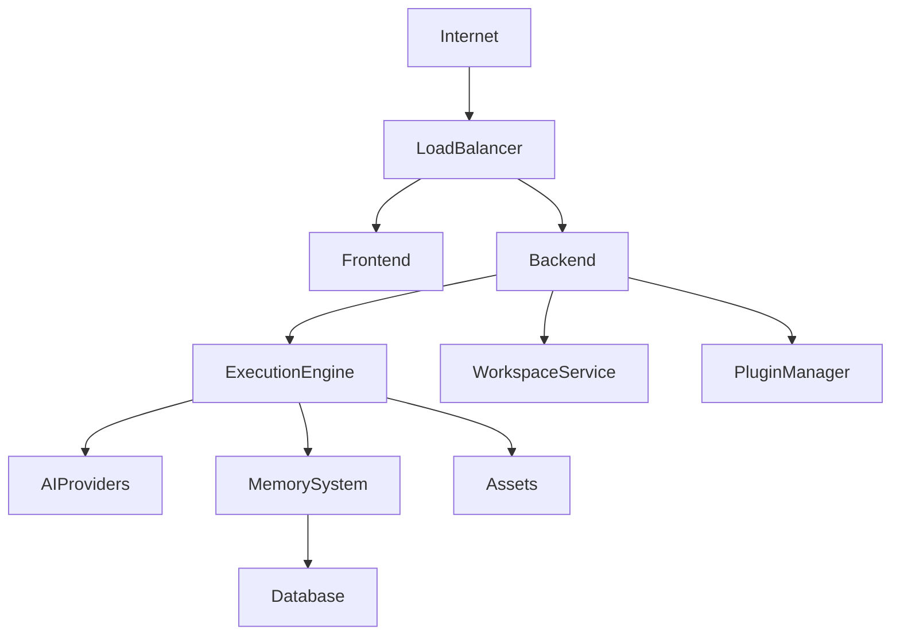

# DEPLOYMENT.md

# Deployment

## Overview

MindMesh is designed to run consistently across development, self-hosted, enterprise, and cloud environments.

The deployment architecture separates the user interface, execution runtime, AI integration layer, and infrastructure services, allowing each component to scale independently.

Deployment should never change how workflows behave. Only the underlying infrastructure changes.

---

# Deployment Philosophy

MindMesh follows four deployment principles.

## Environment Independent

A workflow should execute identically whether running on:

- Local development
- Personal workstation
- On-premise server
- Cloud infrastructure
- Enterprise deployment

---

## Modular Infrastructure

Each subsystem can be deployed independently.

Examples:

- Frontend
- Backend API
- Execution Engine
- AI Gateway
- Databases
- Plugin Services

---

## Horizontal Scalability

Execution services should scale without requiring architectural changes.

Additional workers increase throughput while preserving workflow behavior.

---

## Infrastructure Agnostic

MindMesh is not tied to a specific cloud provider.

Supported environments may include:

- Docker
- Kubernetes
- AWS
- Azure
- Google Cloud
- DigitalOcean
- Bare Metal Servers

---

# Deployment Architecture



---

# Core Components

## Frontend

Responsibilities

- Visual editor
- Workflow builder
- Workspace management
- User interactions

Technology

- React
- TypeScript
- XYFlow

---

## Backend API

Responsibilities

- Request routing
- Authentication
- Workspace management
- Plugin management
- API gateway

Technology

- FastAPI
- Python

---

## Execution Engine

Responsibilities

- Execute workflows
- Schedule nodes
- Handle runtime state
- Coordinate plugins

The execution engine should remain stateless whenever possible.

---

## Memory Service

Responsibilities

- Semantic retrieval
- Long-term storage
- Context management

Possible storage engines include:

- PostgreSQL
- SQLite
- Vector databases
- Object storage

---

## Plugin Manager

Responsible for:

- Plugin discovery
- Loading
- Isolation
- Lifecycle management

---

# Deployment Modes

## Local Development

Designed for rapid iteration.

Typical stack:

```text
React Dev Server

↓

FastAPI

↓

SQLite

↓

Local AI Provider
```

Characteristics

- Single machine
- Fast startup
- Local debugging

---

## Self-Hosted

Suitable for personal servers or small teams.

Typical stack:

```text
Nginx

↓

FastAPI

↓

Execution Workers

↓

PostgreSQL

↓

Redis
```

Characteristics

- Persistent storage
- Reverse proxy
- Background workers

---

## Enterprise

Designed for organizations.

Typical architecture:

```text
Load Balancer

↓

API Cluster

↓

Execution Cluster

↓

Plugin Cluster

↓

Database Cluster
```

Additional capabilities

- Monitoring
- Authentication
- Backups
- High Availability

---

## Cloud Native

Containerized deployment.

Typical stack:

```text
Docker

↓

Kubernetes

↓

Autoscaling

↓

Managed Database

↓

Object Storage
```

Suitable for large-scale deployments.

---

# Containerization

Each major subsystem should be packaged independently.

Example containers:

```text
mindmesh-frontend

mindmesh-backend

mindmesh-runtime

mindmesh-worker

mindmesh-database

mindmesh-monitoring
```

This simplifies maintenance and scaling.

---

# Data Persistence

Persistent data includes:

- Workspaces
- Assets
- User configuration
- Memory
- Execution history
- Plugin metadata

Persistent storage should be separated from runtime containers.

---

# Environment Variables

Deployment configuration should rely on environment variables.

Examples:

```text
API_PORT

DATABASE_URL

REDIS_URL

OPENAI_API_KEY

ANTHROPIC_API_KEY

GROQ_API_KEY

OLLAMA_URL

JWT_SECRET

LOG_LEVEL
```

Secrets should never be committed to version control.

---

# Security

Production deployments should include:

- HTTPS
- JWT authentication
- API rate limiting
- CORS restrictions
- Secret management
- Audit logging

Enterprise environments may also implement:

- SSO
- OAuth2
- LDAP
- Role-Based Access Control

---

# Monitoring

Recommended monitoring stack:

```text
Application

↓

Metrics

↓

Prometheus

↓

Grafana
```

Collected metrics include:

- CPU
- RAM
- API latency
- Workflow duration
- Token usage
- Error rate

---

# Logging

Application logs should be centralized.

Suggested stack:

```text
Application

↓

Structured Logs

↓

Loki

↓

Grafana
```

Logs should include:

- Request ID
- Workspace ID
- Execution ID
- Timestamp
- Severity

---

# Backups

Recommended backup strategy:

Daily

- Database
- Workspaces
- Configuration

Weekly

- Assets
- Plugin registry

Monthly

- Full system snapshot

Backups should be encrypted and verified regularly.

---

# High Availability

Enterprise deployments should support:

- Multiple API instances
- Multiple execution workers
- Database replication
- Automatic failover
- Rolling updates

Workflow execution should continue even if individual services fail.

---

# CI/CD

Recommended deployment pipeline:

```mermaid
graph LR

Developer

-->

Git Repository

-->

Continuous Integration

-->

Automated Tests

-->

Container Build

-->

Deployment

-->

Production
```

Pipeline stages include:

- Static analysis
- Unit testing
- Integration testing
- Security scanning
- Container publishing
- Deployment

---

# Future Deployment Targets

The architecture is designed to support:

- Desktop application
- Cloud SaaS
- Enterprise installations
- Edge computing
- Local AI workstations
- Hybrid cloud deployments

No architectural redesign should be required to support these environments.

---

# Design Philosophy

Deployment should be an infrastructure concern, not an application concern.

MindMesh workflows, plugins, and execution behavior remain consistent regardless of where the platform is deployed.

This separation ensures portability, reproducibility, and long-term maintainability as the platform evolves.
