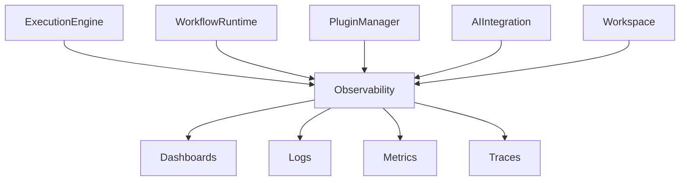

# OBSERVABILITY.md

# Observability

## Overview

Observability enables MindMesh to understand how the platform behaves while workflows are executing.

Unlike traditional logging systems that only report failures, MindMesh continuously collects operational data to improve reliability, performance, debugging, and future optimization.

Observability is considered a first-class architectural component rather than an optional monitoring feature.

---

# Objectives

The observability layer serves five primary goals.

## 1. Understand System Behavior

Provide visibility into what the runtime is doing at any moment.

Examples include:

- Active workflows
- Running nodes
- Resource usage
- AI requests
- Plugin execution

---

## 2. Detect Problems Early

Failures should be identified before they affect users.

Examples:

- Slow executions
- Memory leaks
- API failures
- Plugin crashes
- AI provider outages

---

## 3. Improve Performance

Collected metrics allow developers to optimize:

- Execution latency
- Memory consumption
- Parallel scheduling
- Token usage
- Cost efficiency

---

## 4. Support Debugging

Every workflow execution should be traceable.

Developers must be able to reconstruct:

- Inputs
- Outputs
- Node sequence
- Errors
- Execution timing

---

## 5. Enable Future Intelligence

Observability data can later be used to improve the execution engine itself.

Examples:

- Automatic scheduling optimization
- Predictive failure detection
- Adaptive routing
- AI provider selection
- Runtime learning

---

# Architecture

```mermaid
graph TD

Workflow

-->

Execution Engine

Execution Engine

-->

Metrics

Execution Engine

-->

Logs

Execution Engine

-->

Traces

Metrics

-->

Dashboard

Logs

-->

Storage

Traces

-->

Analysis
```

---

# Pillars of Observability

MindMesh follows the three classical observability pillars.

---

## Metrics

Metrics provide numerical measurements of system behavior.

Examples include:

- CPU utilization
- Memory usage
- API latency
- Node execution time
- Workflow duration
- Active executions
- Queue length
- Token consumption

Metrics are optimized for dashboards and alerts.

---

## Logs

Logs record significant events.

Typical log entries include:

- Workflow started
- Workflow completed
- Plugin loaded
- API request
- Node failure
- Validation error

Logs provide historical context.

---

## Traces

Tracing follows a complete execution from beginning to end.

Example:

```text
Workflow

↓

Node A

↓

Node B

↓

Plugin

↓

AI Provider

↓

Node C

↓

Completed
```

Each step records timing and metadata.

Tracing makes it possible to identify bottlenecks within complex workflows.

---

# Metric Categories

## Runtime Metrics

Examples:

- Active workflows
- Active nodes
- Queue size
- Scheduling delay
- Execution throughput

---

## Infrastructure Metrics

Collected examples:

- CPU usage
- RAM usage
- Disk utilization
- Network traffic
- Storage consumption

These metrics already exist partially through the telemetry service.

---

## AI Metrics

Examples:

- Prompt count
- Completion count
- Token usage
- Average response latency
- Cost estimation
- Failed requests

These metrics help optimize provider selection.

---

## Plugin Metrics

Examples:

- Plugin load time
- Plugin failures
- Average execution time
- Memory usage
- Plugin dependency errors

---

## Workspace Metrics

Examples:

- Number of nodes
- Number of executions
- Asset count
- Workspace size
- Save frequency

---

# Execution Timeline

Each workflow execution generates a timeline.

```text
Workflow Started

↓

Validation

↓

Scheduling

↓

Execution

↓

AI Calls

↓

Plugin Calls

↓

Result Collection

↓

Completed
```

Every stage records timestamps.

---

# Event Model

Events follow a common structure.

Example:

```json
{
    "timestamp": "...",
    "workspace": "...",
    "execution": "...",
    "component": "ExecutionEngine",
    "event": "NodeCompleted",
    "duration_ms": 43
}
```

Standardized events simplify analytics.

---

# Dashboards

Future dashboards may include:

## Runtime Dashboard

Displays:

- Active workflows
- Running nodes
- Queue status
- Worker utilization

---

## AI Dashboard

Displays:

- Provider usage
- Token consumption
- Cost estimates
- Response latency
- Failure rates

---

## Infrastructure Dashboard

Displays:

- CPU
- RAM
- Disk
- Network
- Container status

---

## Plugin Dashboard

Displays:

- Installed plugins
- Plugin activity
- Plugin errors
- Performance metrics

---

# Alerting

Production deployments may define alerts.

Examples:

```text
CPU > 90%

↓

Notify Administrator
```

```text
Workflow Timeout

↓

Cancel Execution
```

```text
AI Provider Offline

↓

Switch Provider
```

```text
Memory Leak Detected

↓

Restart Worker
```

Alerts should prioritize actionable events over excessive notifications.

---

# Recommended Tooling

The architecture is compatible with industry-standard monitoring tools.

Possible stack:

```text
Application

↓

Prometheus

↓

Grafana
```

Logging stack:

```text
Application

↓

Loki

↓

Grafana
```

Tracing stack:

```text
Application

↓

OpenTelemetry

↓

Jaeger
```

These technologies are recommendations rather than requirements.

---

# Performance Goals

Future production targets may include:

| Metric | Target |
|----------|---------:|
| API Response | <100 ms |
| Node Scheduling | <20 ms |
| Workflow Startup | <250 ms |
| Plugin Loading | <100 ms |
| Dashboard Refresh | <1 second |

These values serve as engineering objectives rather than guarantees.

---

# Future Directions

The observability layer is expected to evolve with features such as:

- Distributed tracing
- Predictive anomaly detection
- Automatic bottleneck identification
- Workflow replay
- Historical performance analytics
- Cost forecasting
- AI-assisted debugging
- Runtime optimization recommendations

---

# Relationship with the Architecture

Observability interacts with nearly every subsystem.



Observability does not control execution.

Its responsibility is to make execution understandable.

---

# Design Philosophy

A platform cannot improve what it cannot measure.

MindMesh treats observability as an essential capability that supports reliability, debugging, optimization, and future intelligent adaptation.

As workflows become larger and more autonomous, visibility into system behavior becomes just as important as execution itself.
