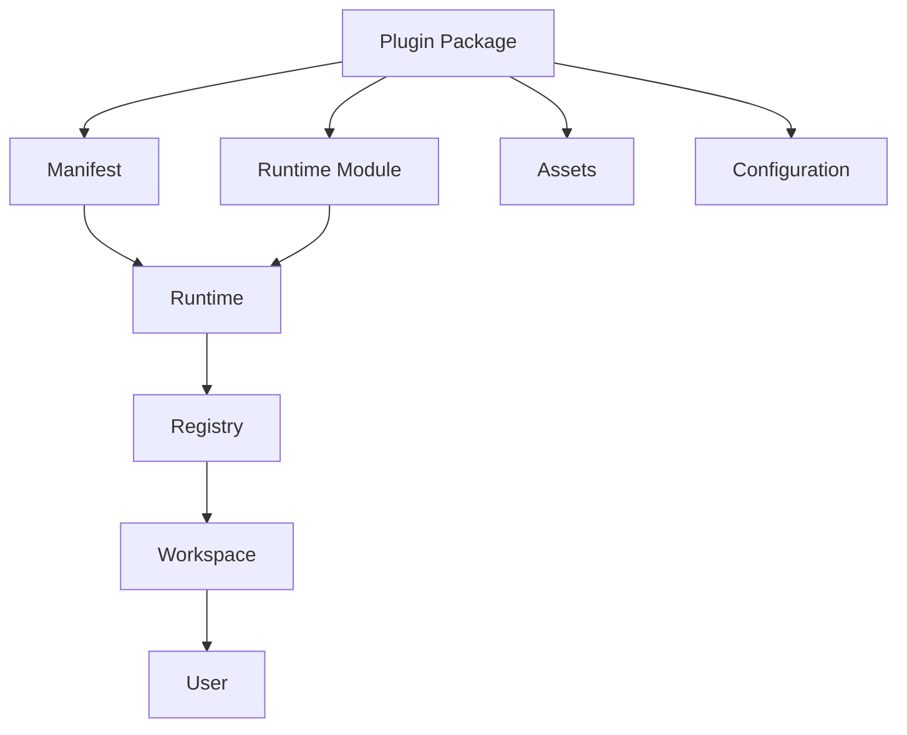
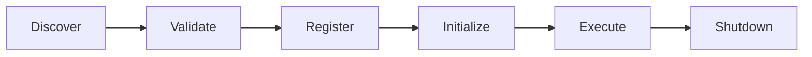

# PLUGIN_SYSTEM.md

# Plugin System

## Overview

MindMesh is designed as an extensible platform rather than a fixed application.

Instead of embedding every capability directly into the core runtime, functionality can be introduced through isolated plugins.

This architecture allows new AI providers, workflow nodes, execution engines, integrations, and visualization tools to be added without modifying the core system.

The objective is to keep the platform modular, maintainable, and adaptable as new technologies emerge.

---

# Design Goals

The plugin system is built around six principles.

## Extensibility

New functionality should be added without modifying existing code.

---

## Isolation

Plugins should operate independently whenever possible.

A faulty plugin should never compromise the stability of the platform.

---

## Discoverability

Plugins should expose metadata that allows the runtime to identify:

- Name
- Version
- Author
- Capabilities
- Dependencies
- Compatible API version

---

## Replaceability

Core services may have multiple implementations.

Examples:

- Different AI providers
- Alternative execution engines
- Multiple storage systems
- Different visualization libraries

The runtime selects the appropriate implementation dynamically.

---

## Security

Plugins execute inside controlled interfaces.

They never receive unrestricted access to:

- Internal runtime state
- Secrets
- Authentication tokens
- Workspace data
- System configuration

Permissions are explicitly granted.

---

## Version Compatibility

Plugins declare the API version they support.

```text
Plugin
      │
      ▼

Runtime Compatibility Check

      │

Compatible?
      │
   Yes ▼      No ▼

Load      Reject
```

---

# Plugin Categories

MindMesh supports multiple plugin categories.

## AI Providers

Responsible for language model integration.

Examples:

- OpenAI
- Anthropic
- Ollama
- Groq
- Gemini
- Cerebras

Responsibilities

- Chat completion
- Embeddings
- Vision
- Tool calling
- Streaming

---

## Node Plugins

Introduce new visual nodes.

Examples

- PDF Reader
- SQL Query
- Image Generator
- Code Executor
- Browser Automation
- Translation
- Vector Search

Each plugin contributes:

- Visual appearance
- Inputs
- Outputs
- Execution logic
- Inspector configuration

---

## Execution Plugins

Allow workflows to execute external systems.

Examples

- REST APIs
- Python scripts
- Docker containers
- Local shell commands
- Message queues

---

## Storage Plugins

Alternative persistence layers.

Examples

- SQLite
- PostgreSQL
- Redis
- ChromaDB
- S3-compatible storage

---

## Workspace Plugins

Provide project templates.

Examples

- Research Workspace
- Writing Workspace
- Engineering Workspace
- AI Automation Workspace

---

## UI Plugins

Extend the interface.

Examples

- Dashboards
- Inspectors
- Visualizers
- Charts
- Timeline widgets

---

# Plugin Architecture



---

# Plugin Manifest

Each plugin exposes a manifest.

Example

```json
{
  "name": "pdf-reader",
  "version": "1.0.0",
  "author": "MindMesh",
  "type": "node",
  "api_version": "1",
  "description": "Extracts structured text from PDF documents.",
  "permissions": [
    "filesystem.read"
  ]
}
```

---

# Plugin Lifecycle



Each stage can fail independently.

Failed plugins are skipped without affecting the runtime.

---

# Runtime Registry

The runtime maintains a centralized registry.

Responsibilities

- Plugin discovery
- Version validation
- Dependency resolution
- Permission validation
- Runtime loading
- Safe unloading

---

# Dependency Resolution

Plugins may depend on other plugins.

Example

```text
Document QA Plugin

↓

Embedding Plugin

↓

Vector Database Plugin

↓

AI Provider Plugin
```

Dependencies are validated before initialization.

---

# Permission Model

Plugins declare required permissions.

Example

```text
Filesystem Read

Filesystem Write

Internet Access

Camera

Microphone

Clipboard

GPU

Environment Variables

Secrets

Workspace Storage
```

Permissions are reviewed before activation.

---

# Failure Isolation

If a plugin crashes,

the runtime should:

- unload the plugin
- report the error
- preserve the current workspace
- continue execution whenever possible

No single plugin should stop the platform.

---

# Plugin Discovery

Possible discovery locations include:

```text
/plugins

/extensions

/user_plugins

/marketplace
```

The discovery mechanism is configurable.

---

# Future Marketplace

The long-term vision includes a plugin marketplace where developers can publish extensions.

Potential categories include:

- AI integrations
- Workflow nodes
- Enterprise connectors
- Visualization tools
- Automation libraries
- Domain-specific workspaces

The marketplace is intentionally outside the core runtime and can evolve independently.

---

# Development Philosophy

MindMesh is not intended to solve every workflow internally.

Instead, it provides a stable execution platform capable of growing through composable extensions.

The plugin system allows the ecosystem to evolve without forcing changes to the architecture.

As the platform expands, plugins become the primary mechanism through which new capabilities are introduced.
