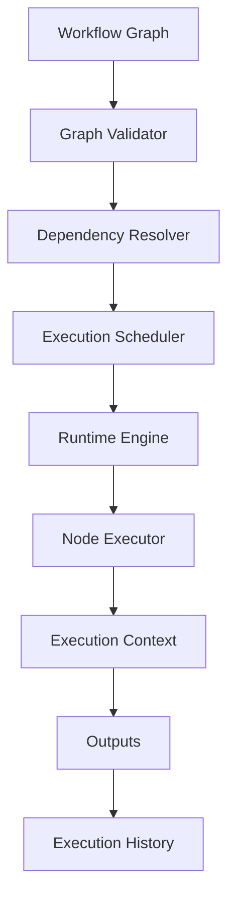

# WORKFLOW RUNTIME — MindMesh

## Overview

The Workflow Runtime is responsible for transforming a visual graph into an executable system.

While the Node System defines individual capabilities, the Runtime coordinates how those capabilities interact, execute, exchange information, and produce outcomes.

The runtime is the execution engine of MindMesh.

---

# Runtime Philosophy

A workflow is not a diagram.

A workflow is an executable graph.

The visual representation exists to help humans understand the system, but the Runtime interprets the graph as an execution plan.
Visual Graph
|
Execution Plan
|
Runtime Scheduler
|
Node Execution
|
Results

---

# Core Responsibilities

The Runtime is responsible for:

- Graph validation
- Dependency analysis
- Execution scheduling
- Context propagation
- Data routing
- State synchronization
- Error handling
- Execution monitoring

---

# Runtime Architecture



---

# Workflow Lifecycle

Every workflow follows the same lifecycle.
Created
↓
Configured
↓
Validated
↓
Compiled
↓
Executed
↓
Monitored
↓
Completed
↓
Stored

---

# Graph Validation

Before execution, every workflow is validated.

Validation includes:

- Missing nodes
- Invalid connections
- Circular dependencies
- Invalid configuration
- Missing required inputs
- Security restrictions

If validation fails, execution never begins.

---

# Dependency Resolution

The Runtime analyzes node relationships before execution.

Example
Input
↓
Scraper
↓
AI Analysis
↓
Decision
↓
Telegram

Execution order is calculated automatically.

Dependencies are derived from graph connections rather than manual sequencing.

---

# Execution Scheduler

The Scheduler determines when each node should execute.

Possible scheduling strategies:

- Sequential
- Parallel
- Event-driven
- Conditional
- Delayed
- Continuous

Future versions may support distributed execution.

---

# Execution Context

Every workflow owns an isolated execution context.

The context contains:

- Runtime variables
- Intermediate outputs
- Shared memory
- Execution metadata
- Current state

Example

```json
{
    "workflow_id": "...",
    "execution_id": "...",
    "variables": {},
    "history": [],
    "metadata": {}
}
```

Each execution is independent from previous runs.

---

# Data Flow

Information moves through directed connections.
Node A
↓
Output
↓
Connection
↓
Input
↓
Node B

The Runtime guarantees that:

- Data arrives in order.
- Types are preserved.
- Invalid payloads are rejected.

---

# Node Execution

Each node follows the same execution protocol.
Receive Input
↓
Validate
↓
Execute Logic
↓
Generate Output
↓
Update State
↓
Notify Runtime

The Runtime never assumes how a node works internally.

It only coordinates execution.

---

# Parallel Execution

Independent branches may execute simultaneously.

Example
      Input
    /       \
Research      Database
\        /
Merge Results

Benefits:

- Lower latency
- Better hardware utilization
- Improved scalability

---

# Conditional Execution

Decision nodes control execution paths.
Decision
/      
True     False
|          |
Task A    Task B

Only the selected branch executes.

---

# Event-Driven Workflows

Some workflows begin only after receiving an event.

Examples:

- API request
- File upload
- Timer
- User interaction
- Webhook
- External notification

Events become execution triggers.

---

# Long Running Workflows

Certain workflows may execute for extended periods.

Examples:

- Monitoring systems
- Research pipelines
- Background agents
- Continuous data collection

The Runtime tracks execution state until completion.

---

# Runtime State Machine

Each node has an execution state.
READY
↓
QUEUED
↓
RUNNING
↓
SUCCESS
or
FAILED
↓
RECOVERED
or
STOPPED

The Runtime continuously updates these states.

---

# Error Handling

Failures are isolated whenever possible.

Runtime behavior:

- Stop failed branch
- Preserve execution history
- Report diagnostics
- Retry if permitted
- Continue unaffected branches

This prevents a single node from stopping the entire workflow.

---

# Resource Management

The Runtime monitors resource usage.

Examples:

- CPU
- Memory
- GPU
- API quotas
- Token usage
- Execution time

Future versions may support automatic workload balancing.

---

# Monitoring

Every execution generates telemetry.

Metrics include:

- Execution duration
- Node latency
- Success rate
- Error frequency
- Token consumption
- Hardware utilization

These metrics support optimization and debugging.

---

# Execution History

Each workflow execution produces a permanent record.

Stored information includes:

- Start time
- End time
- Executed nodes
- Outputs
- Errors
- Performance metrics

Execution history enables reproducibility.

---

# Future Runtime Capabilities

Planned improvements include:

- Distributed execution
- Remote workers
- GPU scheduling
- Workflow versioning
- Incremental execution
- Checkpoint recovery
- Live debugging
- Runtime plugins

---

# Runtime Principles

The Runtime follows several architectural rules.

## Predictability

The same workflow should produce consistent behavior under the same conditions.

---

## Isolation

Workflow executions should never interfere with one another.

---

## Observability

Execution should always be inspectable.

Nothing important should occur silently.

---

## Extensibility

New node types should require minimal Runtime modifications.

---

## Independence

The Runtime coordinates execution.

It does not implement business logic.

Business logic belongs inside nodes.

---

# Final Vision

The Workflow Runtime transforms visual graphs into executable cognitive systems.

It enables users to design complex processes visually while allowing MindMesh to execute them reliably, safely, and efficiently.
Visual Representation
+
Execution Engine
+
Context
+
Monitoring
=
Executable Intelligence

The Runtime is the bridge between workflow design and real-world execution.
