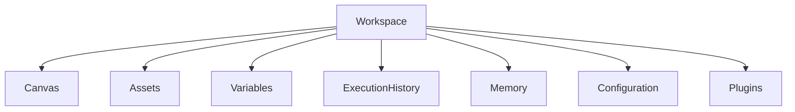
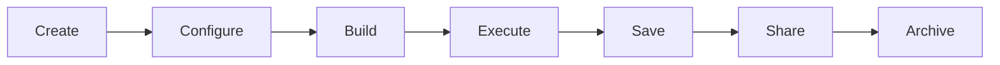

# WORKSPACES.md

# Workspaces

## Overview

A workspace is the highest-level organizational unit in MindMesh.

Rather than being a simple file or canvas, a workspace represents a complete problem-solving environment that combines visual workflows, AI context, documents, execution history, and reusable assets.

Each workspace is isolated, portable, and reproducible.

The objective is to allow users to work on complex projects without mixing context across different domains.

---

# Design Goals

Workspaces are designed around five core principles.

## Context Isolation

Every workspace maintains its own:

- Nodes
- Connections
- Files
- Variables
- AI context
- Execution history
- Settings

Information from one workspace should never leak into another.

---

## Reproducibility

Opening a workspace should restore the exact environment that existed when it was saved.

This includes:

- Node positions
- Connections
- Viewport
- Execution states
- Variables
- Configuration

---

## Portability

A workspace should be transferable between users and machines.

The exported workspace contains only project data and references, without requiring changes to the runtime.

---

## Persistence

Workspaces preserve progress over time.

Users should be able to stop working, close the application, and continue later without losing context.

---

## Extensibility

Different workspace types can define specialized behavior while sharing the same underlying runtime.

---

# Workspace Architecture



---

# Workspace Components

## Canvas

Contains the visual workflow.

Includes:

- Nodes
- Connections
- Groups
- Layout
- Viewport

---

## Assets

Stores project resources.

Examples include:

- PDFs
- Images
- CSV files
- Markdown
- JSON
- Audio
- Video
- Prompt libraries

Assets remain associated with the workspace.

---

## Variables

Workspace-level variables can be referenced by multiple nodes.

Example:

```text
API_KEY

↓

Database Node

↓

LLM Node

↓

Deployment Node
```

Variables reduce duplication across workflows.

---

## Execution History

Stores previous workflow executions.

Each execution records:

- Timestamp
- Inputs
- Outputs
- Runtime
- Errors
- Logs

Execution history enables debugging and reproducibility.

---

## Memory

Some workspace types may maintain long-term contextual memory.

Examples include:

- Research findings
- Previous AI responses
- User annotations
- Knowledge summaries

This memory remains local to the workspace.

---

## Configuration

Workspace configuration includes:

- Theme
- AI provider preferences
- Execution limits
- Cost settings
- Plugin configuration
- Environment variables

---

# Workspace Types

MindMesh supports multiple workspace categories.

---

## Research Workspace

Designed for information gathering.

Typical nodes include:

- Web Search
- PDF Reader
- Notes
- Summarization
- Citation Manager

---

## Writing Workspace

Focused on content production.

Typical workflow:

```text
Research

↓

Outline

↓

Draft

↓

Review

↓

Rewrite

↓

Publish
```

---

## AI Workflow Workspace

Designed for automation pipelines.

Examples:

- Prompt chains
- Tool orchestration
- Agent workflows
- API integration

---

## Engineering Workspace

Focused on software development.

Typical nodes:

- Code Generation
- Documentation
- Testing
- API Explorer
- Git Integration

---

## Automation Workspace

Coordinates external services.

Examples:

- REST APIs
- Email
- Databases
- Messaging
- Scheduling

---

## Custom Workspace

Users can create domain-specific environments through plugins.

---

# Workspace Lifecycle



Each stage preserves project continuity.

---

# Workspace Storage

A workspace contains multiple logical components.

```text
Workspace

├── Canvas
├── Assets
├── Variables
├── Memory
├── Execution History
├── Configuration
├── Plugins
└── Metadata
```

This structure allows independent versioning and synchronization.

---

# Workspace Metadata

Each workspace stores descriptive metadata.

Example:

```json
{
  "name": "Research Assistant",
  "description": "Scientific literature workflow",
  "created": "2026-07-01",
  "updated": "2026-07-10",
  "author": "User",
  "version": "1.0"
}
```

Metadata improves organization and discoverability.

---

# Workspace Templates

Templates provide predefined environments for common tasks.

Examples include:

- Academic Research
- Technical Documentation
- Software Engineering
- AI Agent Design
- Automation Pipeline
- Business Analysis
- Content Creation

Templates accelerate onboarding while remaining fully customizable.

---

# Import and Export

A workspace can be exported as a portable package.

The package contains:

- Canvas
- Configuration
- Variables
- Assets
- Metadata
- Execution History (optional)

Sensitive information such as secrets or credentials is excluded unless explicitly requested.

---

# Collaboration

Future versions may support collaborative workspaces.

Potential capabilities include:

- Multi-user editing
- Shared execution history
- Comments
- Version comparison
- Merge conflicts
- Role-based permissions

The current architecture is designed to accommodate these capabilities without major structural changes.

---

# Relationship with the Runtime

The runtime executes workflows.

The workspace provides context.

```text
Workspace

↓

Execution Engine

↓

Nodes

↓

Results

↓

Execution History

↓

Workspace
```

The runtime is stateless whenever possible.

The workspace is responsible for preserving long-term project state.

---

# Design Philosophy

MindMesh is not centered around individual workflows.

It is centered around persistent working environments.

A workflow represents a sequence of operations.

A workspace represents the complete context in which those operations exist.

By separating execution from context, MindMesh enables users to build reusable, portable, and scalable environments for solving complex problems.
